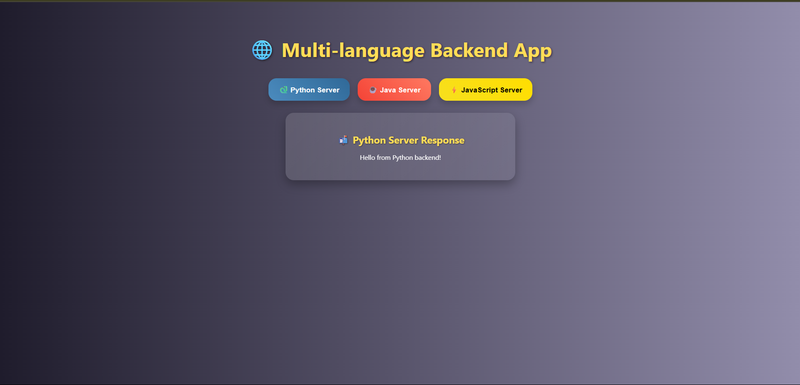
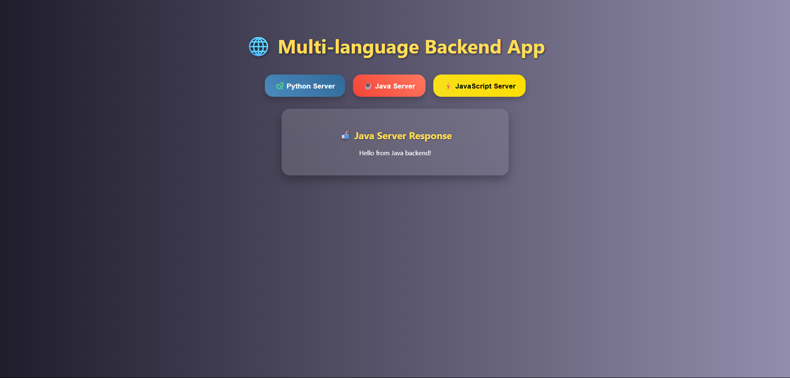

---

## 🧩 Multi-Language Backend Web Application

A full-stack project demonstrating communication between a React frontend and three separate backend servers written in **Python (Flask)**, **Java (Spring Boot)**, and **JavaScript (Node.js + Express)**.

It showcases how multiple technology stacks can coexist in a single system and work together seamlessly.

---

### 📌 Features

* ✨ Single React frontend to interact with all 3 servers
* 🐍 Python backend (Flask)
* ☕ Java backend (Spring Boot)
* ⚡ JavaScript backend (Node.js + Express)
* 🎴 Flash card animations for responses
* 🎨 Dynamic colors and headings based on the server
* 🌐 ReactJS frontend with styled UI and animations
* 🔁 Three separate backend servers (Python, Java, JavaScript)
* ⚡ Flashcard-style animated server responses
* 🧪 Simple demo APIs from each backend
* 📦 Easily extendable for real-world use cases

---

### 📁 Project Structure

```
MultiServer/
│
├── frontend/         # React frontend app
│
├── pythonbackend/    # Python (Flask) backend
│
├── javabackend/      # Java (Spring Boot) backend
│
└── jsbackend/        # JavaScript (Node.js) backend
```

---

### ⚙️ Setup Instructions

#### 1. 🔧 React Frontend

```bash
cd react-frontend
npm install
npm start
```

Access at: `http://localhost:3000`

---

#### 2. 🐍 Python Backend (Flask)

```bash
cd pythonbackend
pip install flask
python app.py
```

Runs at: `http://localhost:5001/python-api`

---

#### 3. ☕ Java Backend (Spring Boot)

Ensure you have JDK 17+ and Maven installed.

```bash
cd javabackend
# If "release 24" error: update your Java version or change the release in pom.xml to 17
mvn spring-boot:run
```

Runs at: `http://localhost:5002/java-api`

---

#### 4. ⚡ JavaScript Backend (Node.js + Express)

```bash
cd jsbackend
npm install
node server.js
```

Runs at: `http://localhost:5003/js-api`

---

### 💡 How It Works

* The React app has 3 buttons.
* Clicking a button sends a request to the respective backend.
* The backend responds with a message.
* The response appears in a beautifully styled animated flash card.
* The card heading and colors change dynamically based on the server clicked.

---

### 📸 Preview







---

### 📃 License

Open source for learning and non-commercial use. Attribution appreciated!

---

## 🧑‍💻 Author

Developed by **A Raghunath Reddy**

---
